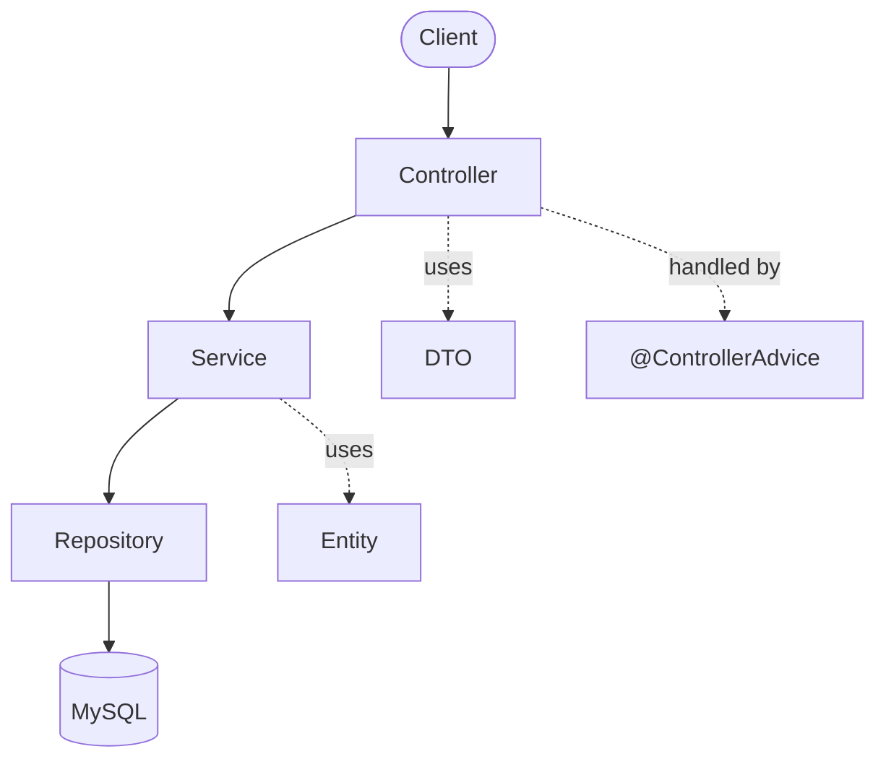
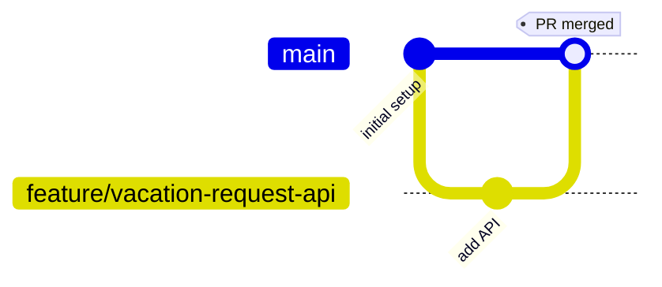

# Vacation System

A Spring Boot backend for managing employee vacation/leave requests: submit a request, route
it for approval, track leave balances.

> **Status: early development.** Only the generated Spring Boot skeleton exists so far. The
> architecture and data model below are the recommended target design, not what's built yet.

## Tech Stack

| Concern   | Choice                                   |
| --------- | ---------------------------------------- |
| Language  | Java 21                                  |
| Framework | Spring Boot 3.3.5 (Web, JPA, Validation) |
| Database  | MySQL — one shared Railway instance     |
| Build     | Maven (`mvnw` wrapper)                 |
| Test DB   | H2 in-memory (test scope only)           |

## Recommended Architecture

Controllers translate HTTP ↔ DTOs, services hold business rules, repositories are thin Spring
Data interfaces, entities never leak out of the API directly.

## Branching Workflow

**Every change gets its own branch — never commit directly to `main`.**

- Prefixes: `feature/`, `fix/`, `docs/`, `chore/`
- Open a PR into `main`; CI (`mvn verify`) must pass before merging.
